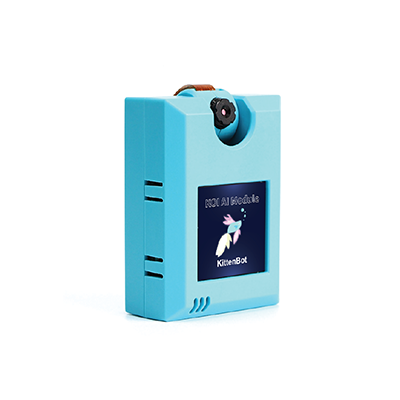

# KOI AI Moudule




## Feature

* This extension is designed to programme and drive the moudule KOI AI Module for micro:bit, You can [get KOI AI Moudule From KittenBot](https://www.kittenbot.cc/collections/frontpage/products/kittenbot-koi-artificaial-intelligence-module)

1. KOI is a module dedicated to AI and IoT applications. You can use it in combination with Micro:bit to make numerous interesting projects.

2. The tiny KOI module based on the K210 chip has various powerful features, which allow you to apply effects like facial recognition, machine learning, and speech recognition to your projects.

3. Not only does KOI include an AI function based on the K210 chip, but it also has a WIFI feature based on the ESP8285 chip, allowing you to make IoT projects.

4. KOI is very small and adopts a Lego-compatible shell structure design. You can combine KOI with Lego bricks to make your own unique projects and feel the charm of STEAM when assembling and programming them.

## Basic usage

- Usage: take pictures, take pictures, display pictures

    Press the KOI button A, take a photo.
    Press button B of KOI to display the captured photos.

```blocks

    koi.koi_onbtn(function (btnA, btnB) {
        if (btnA == 1) {
            koi.koi_screenshot("name.jpg")
        } else if (btnB == 1) {
            if (true) {
                koi.koi_display("name.jpg")
            }
        }
    })
    koi.koi_init(SerialPin.P1, SerialPin.P2)
    basic.showIcon(IconNames.Yes)

```


- Usage: recording, play sound
    Press microbit button A and B respectively to control KOI recording and play sound
    (SD card must be equipped before using this function)

```blocks

    input.onButtonPressed(Button.A, function () {
        koi.koi_audio_rec("say.wav")
    })
    input.onButtonPressed(Button.B, function () {
        koi.koi_audio_play("say.wav")
    })
    koi.koi_init(SerialPin.P1, SerialPin.P2)
    basic.showIcon(IconNames.Yes)

```


- Usage: Color recognition (LineFollower)
    Realize the line-following by colors recognize.

```blocks

    input.onButtonPressed(Button.A, function () {
        koi.koi_colorcali("black")
    })
    input.onButtonPressed(Button.B, function () {
        running = !(false)
    })
    koi.koi_onlinetrack(function (x1, y1, x2, y2) {
        led.plot(x1, 0)
        led.plot(x2, 4)
        basic.pause(100)
        basic.clearScreen()
    })
    let running = false
    koi.koi_init(SerialPin.P1, SerialPin.P2)
    basic.showIcon(IconNames.Yes)
    running = false
    basic.forever(function () {
        if (running) {
            koi.koi_track_line("black")
        }
    })

```


- Usage: Scan code
    canning QR code as an example.(Bar codes and Apriltag are also available)

```blocks

    input.onButtonPressed(Button.A, function () {
        koi.koi_qrcode()
    })
    koi.koi_onqrcode(function (link) {
        basic.showString(link)
    })
    koi.koi_init(SerialPin.P1, SerialPin.P2)
    basic.showIcon(IconNames.Yes)
    koi.koi_lcd_direction(koi.LcdDirection.Back)

```


- Usage: Machine Learning
    Put your hand in the koi screen and press the button A of microbit to learn the material named 'hand' (learning 10 times). Remove your hand and press the button B to learn the material named 'background' (it is also recommended to learn 10 times). Press button A+B to start running recognition. When a hand appears in the camera, the microbit buzzer sounds

```blocks

    input.onButtonPressed(Button.A, function () {
        koi.koi_addtag("hand")
    })
    koi.koi_classified(function (classId) {
        if (classId == "hand") {
            music.playTone(262, music.beat(BeatFraction.Quarter))
        }
    })
    input.onButtonPressed(Button.AB, function () {
        running = !(running)
    })
    input.onButtonPressed(Button.B, function () {
        koi.koi_addtag("background")
    })
    let running = false
    koi.koi_init(SerialPin.P1, SerialPin.P2)
    basic.showIcon(IconNames.Yes)
    koi.koi_lcd_direction(koi.LcdDirection.Back)
    koi.koi_reset_cls()
    running = false
    basic.forever(function () {
        if (running) {
            koi.koi_run()
        }
    })

```


- Usage: Face tracking
    As the position of the face in the koi screen changes, the microbit LED also moves

```blocks

    koi.koi_onfindface(function (x, y) {
        x = 4 - Math.round(240 - x) / (240 / 5)
        y = 4 - Math.round(240 - y) / (240 / 5)
    })
    koi.koi_init(SerialPin.P1, SerialPin.P2)
    basic.showIcon(IconNames.Yes)
    koi.koi_loadyoloface()
    basic.forever(function () {
        let y = 0
        let x = 0
        koi.koi_facedetect()
        basic.clearScreen()
        led.plot(x, y)
    })

```


- Usage: Speech Recognition
    At the beginning of the program, KOI will process of volume calibration, Please keep quiet during this process. After finishing, speak two command words 'one' and 'two' respectively (the same word can be entered multiple times to improve accuracy but upper limit less than 10 in total).
    Start the recognition through microbit A+B, speak the command word, and the microbit will display 'one' or 'two'.

```blocks

    koi.koi_speechcmd_onrecognize(function (classId) {
        basic.showString(classId)
    })
    input.onButtonPressed(Button.A, function () {
        koi.koi_speechcmd_addmodel("one")
    })
    input.onButtonPressed(Button.AB, function () {
        koi.koi_speechcmd_listen()
    })
    input.onButtonPressed(Button.B, function () {
        koi.koi_speechcmd_addmodel("two")
    })
    koi.koi_init(SerialPin.P1, SerialPin.P2)
    basic.showIcon(IconNames.Yes)
    koi.koi_audio_noisetap()

```

----------

## License

MIT

## Supported targets

* for PXT/microbit
(The metadata above is needed for package search.)

```package
koi=github:Kittenbot/pxt-koi
```
